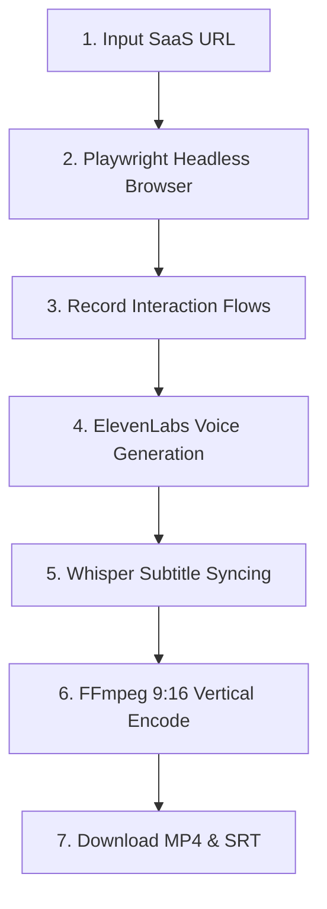

# edit-instant (DemoPilot)

> **Autonomous Video Tutorial & SaaS Walkthrough Creator**

`edit-instant` is an AI-powered agentic workflow that takes any SaaS product URL, autonomously pilots a browser to record interaction flows, synthesizes professional narration, and automatically renders polished 9:16 vertical videos (optimized for YouTube Shorts, Instagram Reels, LinkedIn, and mobile landing pages).

---

> [!IMPORTANT]
> **Project Status: Under Active Development 🚧**
> This repository is currently a work in progress (WIP) and is undergoing active architectural refinement. Interfaces, endpoints, and deployment options are subject to frequent changes.

---

## ⚡ How It Works

1. **Autonomous Browsing**: The system boots up a headless mobile viewport via Playwright, scrolling, clicking, and interacting with the target SaaS dashboard.
2. **Narration Synthesis**: High-retention voiceover is generated using advanced AI speech synthesis (ElevenLabs / mock dev synthesis).
3. **Automated Editing**: Subtitles are synchronized (Whisper/SRT) and merged with the recorded video track.
4. **Final Render**: FFmpeg encodes the vertical video at 30fps, packaging it along with the subtitle files for instant download and sharing.

---

## 🛠️ Tech Stack

- **Backend**: Go (Golang) — Structured using Clean Architecture & Domain-Driven Design (DDD) principles.
- **Frontend**: Vue 3 + Tailwind CSS + Lucide Icons — Designed around premium, systemized B2B dashboard aesthetics (Linear/Vercel vibes).
- **Core Automation**: Playwright (Browser Puppeteer), ElevenLabs/TTS API, and FFmpeg (Video Encoding Engine).

---

## 🚀 Getting Started

### Prerequisites
- [Go](https://go.dev/) (v1.20+)
- [Node.js](https://nodejs.org/) (v18+)
- [FFmpeg](https://ffmpeg.org/) installed and available in your system path.

## 📝 License
This project is proprietary and currently under development. All rights reserved.
