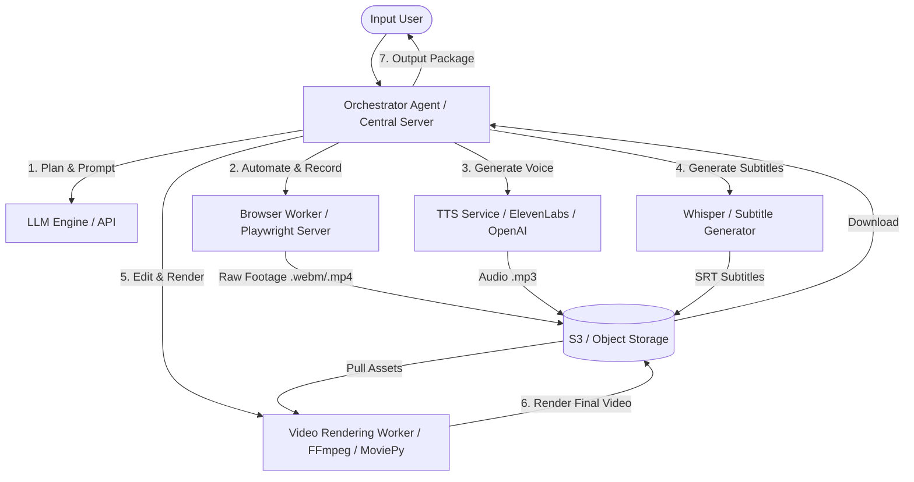

# TikTok Konten AI Agent: Alur Kerja & Arsitektur Teknis

Dokumen ini menjelaskan rancangan alur kerja dan arsitektur teknis untuk membangun **Autonomous TikTok Content Production AI Agent** berdasarkan spesifikasi sistem yang telah ditentukan.

---

## 📐 Diagram Arsitektur (Distributed/Separate Servers)

Untuk menjamin kualitas video rekaman yang mulus (tidak *lag*) dan rendering yang cepat, arsitektur berbasis **Distributed Microservices/Multi-Agent** sangat direkomendasikan. Berikut adalah visualisasi aliran data antar komponen:

---

## 📊 Tabel Alur Kerja Step-by-Step

Berikut adalah pemetaan setiap langkah pembuatan video dari input hingga menjadi konten TikTok yang siap upload, lengkap dengan pembagian peran server dan teknologi yang digunakan:

| Langkah (Step) | Nama Proses | Deskripsi Kerja | Siapa yang Mengerjakan? | Di Mana Berjalan? | Teknologi & Library Rekomendasi |
| :--- | :--- | :--- | :--- | :--- | :--- |
| **Step 1** | **Website Understanding** | Menganalisis landing page, dashboard, menu, dan alur kerja utama dari `PRODUCT_URL`. | **Orchestrator Agent (LLM)** | Central Server + LLM API | Playwright (HTML scraper), GPT-4o / Claude 3.5 Sonnet |
| **Step 2** | **Content Strategy** | Mengonversi ide skrip menjadi hook TikTok yang kuat, alur tutorial, narasi, dan CTA. | **Orchestrator Agent (LLM)** | Central Server | GPT-4o / Claude 3.5 Sonnet (Structured Outputs) |
| **Step 3** | **Generate Video Plan** | Membuat perencanaan detail adegan demi adegan (scene) dalam format JSON terstruktur. | **Orchestrator Agent (LLM)** | Central Server | JSON Schema, Pydantic (Python) / Zod (Node.js) |
| **Step 4** | **Browser Automation** | Menjalankan otomatisasi login, navigasi dashboard, dan aksi tutorial secara realistis. | **Browser Worker** | Dedicated Browser Server (Docker / VPS terpisah) | Playwright / Puppeteer, `ghost-cursor` (simulasi mouse natural) |
| **Step 5** | **Screen Recording** | Merekam interaksi browser secara vertikal (9:16, 1080x1920) dengan gerakan yang mulus. | **Browser Worker** | Dedicated Browser Server | xvfb (Virtual Display), FFmpeg / Playwright Video Recorder |
| **Step 6** | **Voice Over Generation** | Menghasilkan suara narasi kecerdasan buatan (AI Voice) yang natural, dinamis, dan tidak kaku. | **Voice & Text Engine** | API Provider Eksternal | ElevenLabs API, OpenAI TTS, atau Bark (Self-hosted) |
| **Step 7** | **Subtitle Generation** | Mentranskripsi suara ke teks dan menyelaraskan penanda waktu (timestamp) secara presisi. | **Voice & Text Engine** | AI Transcriber / API | OpenAI Whisper API (Word-level timestamps) -> `.srt` file |
| **Step 8** | **Video Editing** | Memotong bagian kosong (dead air), mempercepat loading, memberi efek zoom, transisi, dan musik latar. | **Video Editing Worker** | GPU-Accelerated Server / Serverless GPU | FFmpeg CLI, Python MoviePy, Remotion (React), atau Editframe |
| **Step 9** | **TikTok Optimization** | Menerapkan retensi taktik: perubahan visual setiap 2-3 detik, teks dinamis, dan efek interupsi pola. | **Video Editing Worker** | GPU-Accelerated Server | FFmpeg filters (zoompan, crop, overlay) |
| **Step 10** | **Generate Final Output** | Mengekspor video akhir `.mp4`, thumbnail `.png`, suara `.mp3`, subtitle `.srt`, serta menyusun caption & hashtag. | **Orchestrator Agent** | Central Server | Python/Node.js backend, S3 integration |

---

## 🧠 Detail Implementasi Kunci & Tantangan Teknis

### 1. Simulasi Gerakan Manusia pada Browser (Step 4)
*   **Tantangan:** Deteksi bot pada website modern dapat memblokir aksi otomatisasi jika gerakan kursor terlalu lurus dan kecepatan mengetik konstan.
*   **Solusi:** Gunakan library **ghost-cursor** untuk menghasilkan kurva Bezier pada pergerakan mouse. Tambahkan variasi *delay* acak (100ms - 500ms) saat mengetik atau mengklik tombol untuk meniru perilaku manusia asli.

### 2. Perekaman Layar 9:16 yang Mulus (Step 5)
*   **Tantangan:** Playwright secara default merekam seluruh ukuran viewport.
*   **Solusi:** Set ukuran viewport browser ke **1080x1920** (posisi vertikal mobile) dengan mengubah user-agent ke tipe Mobile Chrome. Jalankan di dalam virtual framebuffer (Xvfb) dengan *framerate* stabil minimum 30 FPS atau 60 FPS untuk hasil terbaik.

### 3. Sinkronisasi Suara dan Subtitle Otomatis (Step 7)
*   **Tantangan:** Subtitle harus muncul tepat saat kata tersebut diucapkan (Word-level synchronization).
*   **Solusi:** Gunakan API transkripsi yang mendukung penanda waktu per kata (seperti Whisper dengan parameter `timestamp_granularities="word"`). Ini memungkinkan Anda membagi teks menjadi segmen pendek berdurasi 1-3 kata untuk meningkatkan retensi TikTok.

### 4. Kompresi & Pemrosesan Video Cepat (Step 8)
*   **Tantangan:** Proses rendering video resolusi tinggi di CPU biasa bisa memakan waktu lebih lama daripada durasi video itu sendiri.
*   **Solusi:** Gunakan akselerasi perangkat keras (hardware acceleration) seperti **NVIDIA NVENC** pada FFmpeg, atau gunakan layanan rendering berbasis awan (cloud serverless GPU) seperti Replicate atau RunPod untuk memproses video dalam hitungan detik.
